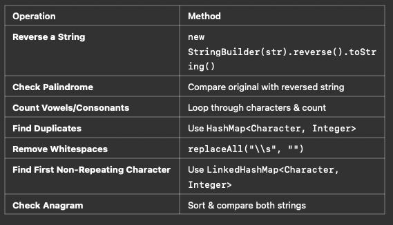

## Final Thoughts
#### •	Immutable: Strings cannot be changed once created.
#### •	Use StringBuilder for mutable strings.
#### •	String operations in Java are optimized, but avoid excessive concatenations (+), use StringBuilder.append() instead.