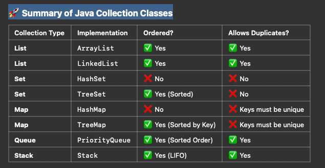

## Key Takeaways
### •	Use ArrayList for fast access, LinkedList for fast insertions/deletions.
### •	Use HashSet for unique elements, TreeSet for sorted unique elements.
### •	Use HashMap for fast lookups, TreeMap for sorted keys.
### •	Use PriorityQueue for priority-based elements.
### •	Use ConcurrentHashMap for multi-threaded safety.

