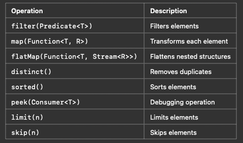
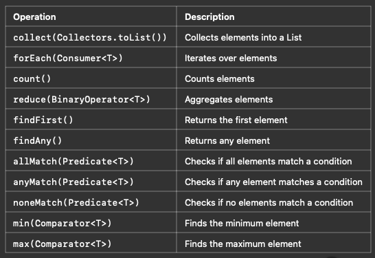

## Stream Operations

### •	Intermediate Operations (Lazy)
#### •	Transform streams, returning another Stream.
#### •	 Executed only when a terminal operation is called.

### Terminal Operations
#### •	These consume the stream and return a result.
#### •	After a terminal operation, the stream cannot be reused.

###  Summary

#### •	Streams process data functionally (no explicit loops).
#### •	Intermediate operations (e.g., filter, map) are lazy.
#### •	Terminal operations (e.g., collect, reduce) consume the stream.
#### •	 Parallel streams can improve performance on large datasets.
#### •	FlatMap helps in handling nested collections.